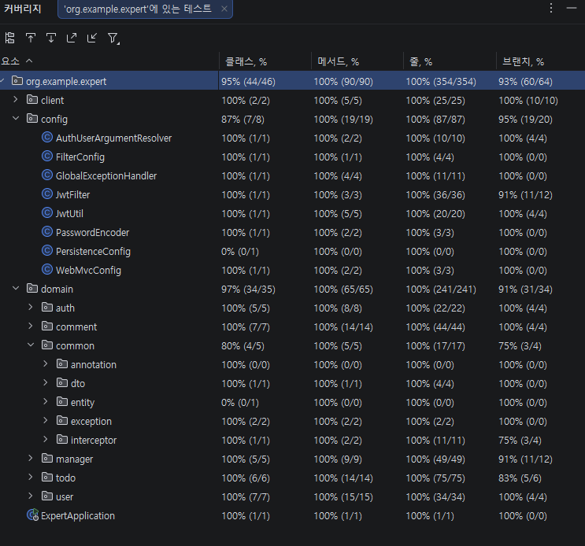

# SPRING ADVANCED

## [포스트맨 링크](https://documenter.getpostman.com/view/51111882/2sBXcKDJsU)

### [심화 스프링.postman_collection.json](../../%EB%85%B9%ED%99%94%EC%98%81%EC%83%81/%EC%8B%AC%ED%99%94%20%EC%8A%A4%ED%94%84%EB%A7%81.postman_collection.json)

### [TIL 링크](https://velog.io/@rxg_1211/Day42)
